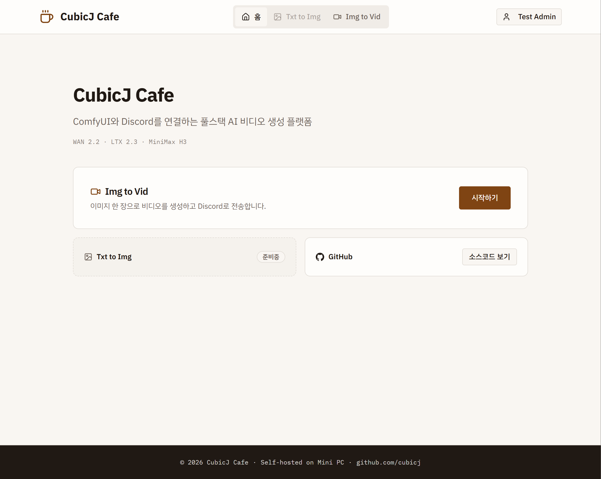
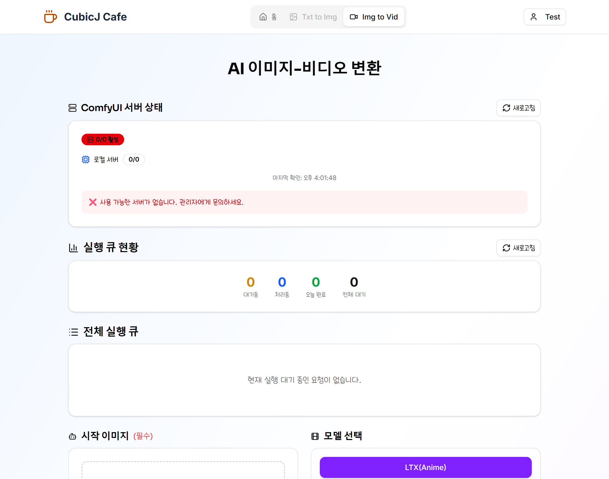
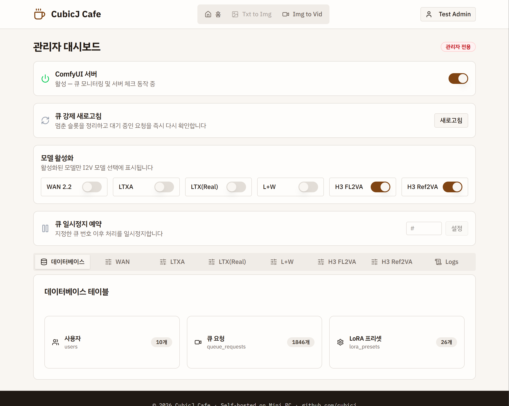

# CubicJ Cafe

AI Image-to-Video generation web frontend powered by ComfyUI.

Upload an image, write a prompt, and get a generated video delivered to Discord — with a queue, multi-model routing, and a full admin dashboard on top.

## Screenshots



| Generation | Admin Dashboard |
|------------|-----------------|
|  |  |

## Features

- **Image-to-Video** — Upload an image with a prompt, get a generated video
- **Multi-Model** — Five workflow pipelines dispatched through a single capability-driven registry

  | Model | End Image | Audio | Duration |
  |-------|:---------:|:-----:|----------|
  | WAN 2.2 | ✓ | — | 5–7s |
  | LTX (Anime) | — | ✓ | 5–7s |
  | LTX (Real) | ✓ | ✓ | 5–7s |
  | L+W (LTX + WAN hybrid) | ✓ | ✓ | 5–8s |
  | H3 FL2VA (MiniMax) | ✓ | ✓ | frame-count based |

  H3 FL2VA takes a first frame, a last frame, or both — any single image is enough (F2VA / L2VA / FL2VA modes).

- **Queue System** — Serializable queue with atomic position assignment and real-time status tracking
- **LoRA Presets & Bundles** — Drag-and-drop preset management, per-model availability gated by capability flags
- **Audio Presets** — Upload and reuse audio clips for audio-capable models
- **Prompt Translation** — Built-in translation endpoint for non-English prompts
- **Discord Integration** — OAuth2 auth + in-process bot delivery of completed videos
- **Admin Dashboard** — Model activation toggles, queue control and pause scheduling, live log viewer (SSE), ComfyUI monitoring, DB browser
- **Multi-Server** — Auto-selects between local and cloud (RunPod) ComfyUI instances

## Tech Stack

| Layer | Technology |
|-------|-----------|
| Frontend | Next.js 16, React 19, TailwindCSS 4, Shadcn/ui |
| Backend | Next.js API Routes, Prisma 7 (better-sqlite3 driver adapter), SQLite |
| Auth | Custom Discord OAuth2 (HttpOnly cookie sessions) |
| Validation | Zod v4 schemas across all route handlers |
| AI Backend | ComfyUI API (JSON workflow graphs) |
| Bot | Discord.js (in-process) |
| Testing | Vitest, SQLite test DB, route handler direct invocation |
| Logging | Custom unified logger (server + client → files + SSE) |
| Deployment | systemd + Nginx + SSL (Next.js standalone) |

## Project Structure

```
src/
├── app/
│   ├── api/          # 46 API route handlers
│   │   ├── i2v/      # Video generation endpoint
│   │   ├── queue/    # Queue management + monitoring
│   │   ├── admin/    # Protected admin routes
│   │   └── auth/     # Discord OAuth2 flow
│   ├── i2v/          # Generation page
│   ├── admin/        # Admin dashboard
│   ├── profile/      # User profile
│   └── settings/     # User settings
├── lib/
│   ├── comfyui/      # Queue/job monitors, server management
│   │   └── workflows/  # Per-model builders (wan, ltxa, ltxr, ltx-wan, h3-fl2va) + registry
│   ├── database/     # Prisma service layer
│   ├── auth/         # Session management, withAuth/withAdmin HOF
│   ├── validations/  # Zod schemas + parse helpers
│   └── logger.ts     # Client-safe unified logger
├── components/       # Shadcn/ui base + domain components
├── contexts/         # React Context (session, form state)
└── hooks/            # Custom React hooks
tests/                # Mirrors src/ (route handler tests hit real DB sessions)
├── app/api/          # API route tests via direct handler invocation
├── lib/              # Module tests
├── helpers/          # Shared fixtures, seeds, auth builders
└── perf/             # Benchmarks
```

## Development

```bash
npm install
npm run prisma:migrate    # Set up database
npm run dev               # Dev server
npm test                  # 570 tests
npm run type-check        # tsc --noEmit
npm run lint              # ESLint
```

## Deployment

Runs as a systemd service with Next.js standalone output. Environment variables live in `.env` (not version controlled — see `.env.example` for the template).

Production uses `.env.production` loaded via systemd `EnvironmentFile`.

```bash
npm run build
# Deploy .next/standalone + .next/static + public to target
# systemd EnvironmentFile loads .env.production
# ExecStart: node .next/standalone/server.js
```

## Architecture Notes

- ComfyUI workflows are JSON node graphs — each model has a completely different structure, dispatched via `workflow-router.ts`
- Model capabilities (end image, audio, duration, LoRA) live in a single registry that gates both UI and API validation
- Queue uses Serializable isolation for atomic position assignment
- Logger is split: `logger.ts` stays client-safe (no `fs`), file I/O in `logger-file.ts` connected via `instrumentation.ts`
- Discord bot runs in-process (not a separate service)
- All state singletons use `globalThis` to survive Next.js dev hot reload

## License

[MIT](LICENSE)
